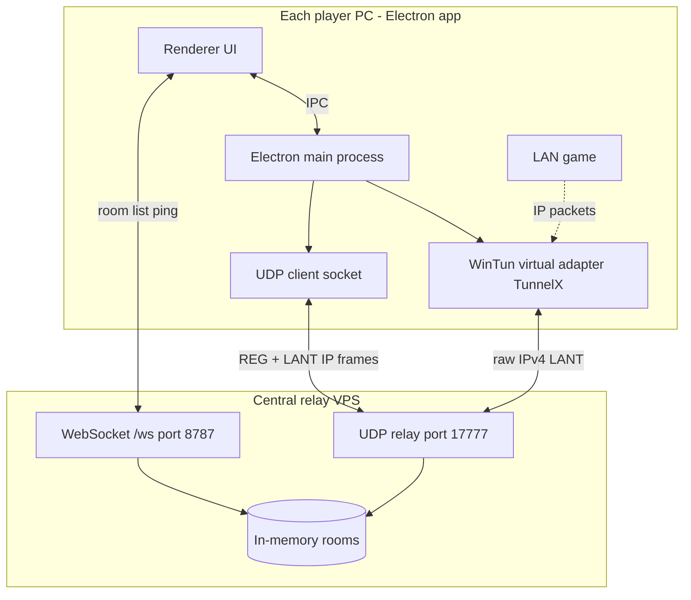

# LANBridge / TunnelX — System Architecture

## Goal (from requirements)

Make remote Windows PCs appear on the **same virtual LAN** so classic games (Stronghold, NFSU2, CS 1.6) can use **LAN / local network** multiplayer without modifying game files.

---

## High-level picture



**Two layers (must both work for in-game discovery):**

| Layer | What works when | User-visible |
|--------|------------------|--------------|
| **Lobby** | WebSocket to relay | Player list, ping, room name |
| **Virtual LAN** | WinTun adapter + UDP `LANT` relay | Stronghold / CS LAN browser |

Lobby alone is **not enough** for games. The virtual adapter must show **“LAN adapter running”**.

---

## Components

### 1. Signaling server (`server/app.js`)

- **HTTP** `8787`: health check
- **WebSocket** `/ws`: create/join room, ping/pong, member list
- **UDP** `17777`: packet relay between peers in the same room

**Virtual IPs:** `10.0.0.x/24` (host/joiners get `10.0.0.2`, `10.0.0.3`, …).

**Room model:** In-memory map keyed by **room name** (no accounts). Each peer has:

- `peerId`, `name`, `virtualIp`, `ws`, `udpAddr` (after registration)

### 2. Relay framing (`lib/relay.js`)

| Magic | Purpose |
|-------|---------|
| `LANB` | App control (`REG\|peerId` on UDP) |
| `LANT` | Raw IPv4 packet from WinTun |

Payload: `magic + roomId(16 bytes hex) + data`

### 3. Electron client (`electron/main.js`)

On **join welcome**:

1. Open UDP socket (ephemeral port).
2. Start **WinTun** in-process (`electron/tun-win.js`) — adapter name **TunnelX**, IP = assigned virtual IP.
3. Send `REG|peerId` to relay; repeat every 25s (NAT keepalive).
4. **Outbound:** game → WinTun → `onPacket` → wrap `LANT` → UDP to relay.
5. **Inbound:** relay → UDP → unwrap `LANT` → inject into WinTun → game.

**Windows routing** (`electron/network-setup.js`): lower interface metric + on-link route for `10.0.0.0/24` so more LAN traffic uses TunnelX.

### 4. UI (`renderer/app.js`)

- Host → cloud relay `98.70.25.166:8787`
- Join → same server + room name
- Preflight: admin check + WinTun files present
- Reconnect: WebSocket auto-reconnect; **LAN adapter stays up** during brief lobby drops

### 5. Native bundle (`native/` + `node_modules/.../node-tuntap2-wintun`)

- `tuntap2Addon.node` — prebuilt, no Visual Studio at build time
- `wintun-amd64.dll`
- Copied into `native/` on `npm install` for reliable portable packaging

---

## End-to-end flow (success path)

1. Both users run TunnelX **as Administrator**.
2. Both join room `friday` on the same relay.
3. Tunnel status: **LAN adapter running**; virtual IPs e.g. `10.0.0.2` / `10.0.0.3`.
4. Windows shows **TunnelX** network adapter.
5. Open Stronghold → **LAN multiplayer** → peers should appear.

---

## Important: WinTun return codes

In `@xiaobaidadada/node-tuntap2-wintun`, **`init()` and `set_ipv4()` return `1` on success**, not `0`. Older TunnelX builds wrongly treated `1` as failure and showed `Wintun.init failed (code 1)` even when the driver was fine.

## Troubleshooting: real WinTun / adapter failures

**Not fixed by turning off Windows Firewall.** Firewall blocks traffic later; failures happen when the **driver/adapter** cannot start.

Try in order:

1. **Run TunnelX as Administrator** (right-click → Run as administrator).
2. **Quit all other VPN/tunnel apps** (WireGuard, OpenVPN, Tailscale, ProtonVPN, another TunnelX).
3. **Close every TunnelX window**, wait 10 seconds, open one copy as Admin.
4. **Reboot** the PC if a VPN crashed and left WinTun stuck.
5. **Admin PowerShell** (only if still code 1):
   ```powershell
   sc.exe delete wintun
   ```
   Then start TunnelX again (it reinstalls the driver).
6. **Network adapters:** Settings → Network → if a broken **TunnelX** adapter exists, disable it, reboot, try again.

Optional: allow TunnelX through firewall on **Private** networks after the adapter works.

---

## Known limitations (honest)

1. **Administrator required** — WinTun needs it to create the adapter.
2. **Game must use LAN over IP** — some titles bind only to the physical NIC; routing/metric helps but is not 100% for every old game.
3. **Central relay** — UDP game traffic goes through your VPS (`17777` must be open).
4. **No encryption** — academic tunnel, not a commercial VPN.
5. **No SQLite** — not needed; rooms are in-memory on the server.
6. **Room names are global** on one relay — duplicate names on the same server conflict.

---

## Bug fixes applied in this audit

| Issue | Fix |
|-------|-----|
| Portable missing `jmespath` | Direct WinTun load; `jmespath` dependency + unpack |
| Sidecar `node` / portable spawn | In-process WinTun only |
| Preflight init/close broke next start | Preflight checks files only |
| Native not in portable | `native/` bundle + path fallbacks |
| Lobby reconnect killed adapter | `stopBridgeSession` only on Leave |
| UDP registration once | REG every 25s |
| Wrong subnet vs spec | `10.0.0.0/24` |
| Games ignore virtual NIC | `network-setup.js` routes + metric |
| VS required on `npm run dist` | `npmRebuild: false` + prebuild |

---

## Build & run (developer)

```bash
npm install          # downloads prebuild + copies to native/
npm run client       # dev — elevated terminal
npm run server       # optional local relay
npm run dist         # portable/setup (no VS if prebuild present)
```

---

## File map

```
LANBrige/
  server/app.js          # relay + rooms
  lib/relay.js           # LANB/LANT protocol
  electron/
    main.js              # session orchestration
    tun-win.js           # WinTun in-process
    wintun-paths.js      # resolve .node / .dll
    session-tun.js       # admin + singleton tun
    network-setup.js     # netsh route/metric
    admin.js             # elevation check
  renderer/app.js        # UI + WebSocket client
  native/                # shipped WinTun binaries
  scripts/ensure-wintun-prebuild.js
```
